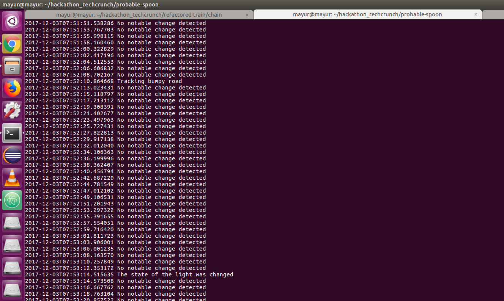

# Simulator for IoT data
This repo is based on python that takes the data in json format, processes it and creates blocks on the blockchain running on Etherium.

## Dependencies
1. Numpy
2. web3py
3. Solidity compiler (solc)


## Running the simulator
You will need the contract file to create an instance of the contract
This is located in our other repo: 
```
git clone https://github.com/truckchain/refactored-train
```
Now run the final_script:
```
python3 final_script.py
```


